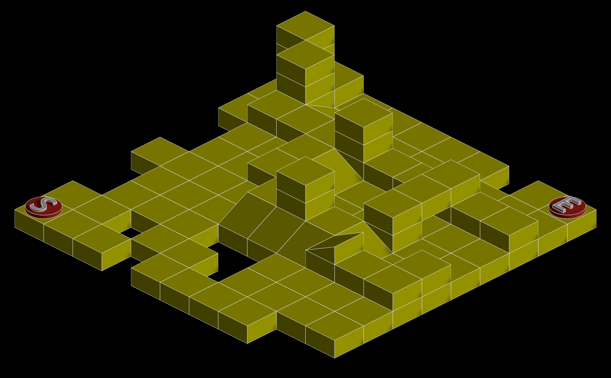
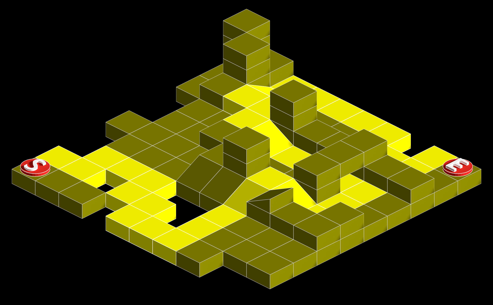
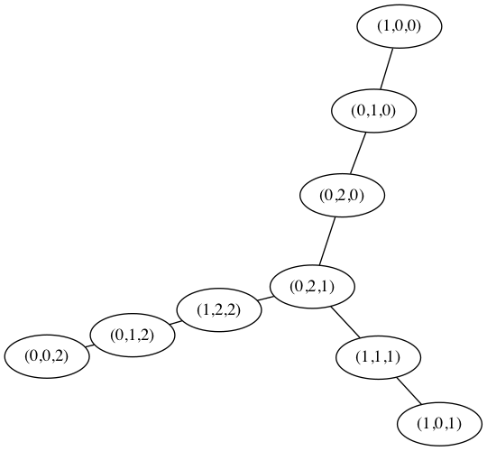

# Travail pratique 2

## Description

Ce programme permet de générer une carte isométrique. Une carte isométrique est
une carte en pseudo-3D dans laquelle apparaissent des tuiles, qui sont
simplement des images. Voici un exemple d'une telle carte.

Les tuiles utilisées pour produire cette carte se trouvent dans le répertoire
`art`. Elles ont été conçues à l'aide du logiciel libre et open-source
[Blender](https://www.blender.org/). Pour construire une telle carte, il suffit
de fournir un fichier au format [JSON](http://www.json.org/json-fr.html), un
format populaire permettant de structurer de l'information. Dans l'exemple
ci-haut, le fichier utilisé est le suivant :

~~~json
{
    "numrows": 10,
    "numcols": 10,
    "tiles":
        [
            {
                "id": "1",
                "filename": "art/end.png",
                "directions": [[1,0,-1], [-1,0,-1], [0,1,-1], [0,-1,-1]]
            },
            {
                "id": "2",
                "filename": "art/flat.png",
                "directions": [[1,0,0], [-1,0,0], [0,1,0], [0,-1,0],
                               [1,0,1], [-1,0,1], [0,1,1], [0,-1,1]]
            },
            {
                "id": "3",
                "filename": "art/ne.png",
                "directions": [[1,0,-1], [-1,0,0]]
            },
            {
                "id": "4",
                "filename": "art/nw.png",
                "directions": [[0,1,-1], [0,-1,0]]
            },
            {
                "id": "5",
                "filename": "art/se.png",
                "directions": [[0,-1,-1], [0,1,0]]
            },
            {
                "id": "6",
                "filename": "art/start.png",
                "directions": [[1,0,-1], [-1,0,-1], [0,1,-1], [0,-1,-1]]
            },
            {
                "id": "7",
                "filename": "art/sw.png",
                "directions": [[-1,0,-1], [1,0,0]]
            }
        ],
    "tilewidth": 256,
    "layeryoffset": -78,
    "layers":
        [
            {
                "data": [2, 2, 2, 2, 2, 2, 2, 0, 2, 2,
                         2, 2, 2, 2, 2, 2, 2, 2, 2, 2,
                         2, 2, 2, 2, 2, 2, 2, 2, 2, 2,
                         0, 2, 2, 2, 2, 2, 2, 2, 2, 2,
                         0, 2, 2, 2, 2, 2, 2, 2, 2, 2,
                         2, 2, 2, 2, 2, 2, 2, 2, 2, 2,
                         0, 2, 2, 2, 2, 2, 2, 2, 2, 2,
                         0, 2, 2, 2, 0, 0, 2, 2, 2, 2,
                         2, 2, 0, 2, 2, 0, 2, 2, 2, 2,
                         2, 2, 2, 0, 2, 2, 2, 2, 0, 0]
            },
            {
                "data": [2, 2, 0, 0, 0, 0, 0, 0, 0, 1,
                         0, 2, 7, 0, 0, 0, 0, 0, 0, 0,
                         0, 2, 2, 2, 2, 2, 2, 2, 2, 2,
                         0, 0, 0, 2, 4, 0, 0, 0, 0, 0,
                         0, 0, 0, 2, 0, 0, 0, 2, 0, 0,
                         0, 0, 0, 0, 2, 2, 2, 4, 0, 2,
                         0, 0, 0, 0, 3, 3, 3, 2, 2, 2,
                         0, 0, 0, 0, 0, 0, 0, 0, 0, 0,
                         0, 0, 0, 0, 0, 0, 0, 0, 0, 0,
                         6, 0, 0, 0, 0, 0, 0, 0, 0, 0]
            },
            {
                "data": [2, 0, 0, 0, 0, 0, 0, 0, 0, 0,
                         0, 2, 0, 0, 0, 0, 0, 0, 0, 0,
                         0, 0, 0, 0, 2, 0, 0, 2, 0, 0,
                         0, 0, 0, 0, 0, 0, 0, 2, 0, 0,
                         0, 0, 0, 0, 0, 0, 0, 2, 0, 0,
                         0, 0, 0, 0, 0, 2, 0, 0, 0, 0,
                         0, 0, 0, 0, 0, 0, 0, 5, 0, 0,
                         0, 0, 0, 0, 0, 0, 0, 0, 0, 0,
                         0, 0, 0, 0, 0, 0, 0, 0, 0, 0,
                         0, 0, 0, 0, 0, 0, 0, 0, 0, 0]
            },
            {
                "data": [2, 0, 0, 0, 0, 0, 0, 0, 0, 0,
                         0, 2, 0, 0, 0, 0, 0, 0, 0, 0,
                         0, 0, 0, 0, 2, 0, 0, 0, 0, 0,
                         0, 0, 0, 0, 0, 0, 0, 0, 0, 0,
                         0, 0, 0, 0, 0, 0, 0, 0, 0, 0,
                         0, 0, 0, 0, 0, 2, 0, 0, 0, 0,
                         0, 0, 0, 0, 0, 0, 0, 0, 0, 0,
                         0, 0, 0, 0, 0, 0, 0, 0, 0, 0,
                         0, 0, 0, 0, 0, 0, 0, 0, 0, 0,
                         0, 0, 0, 0, 0, 0, 0, 0, 0, 0]
            }
        ]
}
~~~

La commande utilisée pour générer l'image plus haut est

~~~bash
$ bin/tp2 --input-filename data/map.json --output-format png --output-filename map.png
~~~

Le programme permet entre autres d'inclure la solution dans l'image. Pour cela,
il suffit d'utiliser l'option `with-solution` et d'indiquer les points de
départ et d'arrivée:

~~~bash
$ bin/tp2 --with-solution --start 1,0,9 --end 1,9,0 --input-filename data/map.json --output-format png --output-filename map.png
~~~

On obtient alors la carte suivante :

## Fonctionnement

Assurez-vous d'abord d'avoir installé toutes les dépendances nécessaires au
fonctionnement (voir la section [Dépendances](#dependances)).

Ensuite, il suffit d'entrer

~~~bash
make
~~~

pour générer un programme exécutable, situé dans `bin/tp2` puis d'appeler le
programme depuis le répertoire courant (ne pas se déplacer dans le répertoire
`bin`).

Les différentes options peuvent facilement être consultées en entrant
~~~bash
$ bin/tp2 --help                                                              
Usage: bin/tp2 [--help] [--start L,R,C] [--end L,R,C] [--with-solution]
    --input-filename FILENAME [--output-format STRING]
    [--output-filename FILENAME]

Generates an isometric map from a JSON file.

Mandatory argument:
  --input-filename STRING  The name of the JSON input file.
                           The file must respect the right format.
                           See README for more details.
Optional arguments:
  --help                   Shows this help message and exit
  --start L,R,C            The start point (L,R,C) in the map,
                           where L is the layer, R the row and
                           C the column.
  --end L,R,C              The end point (L,R,C) in the map,
                           where L is the layer, R the row and
                           C the column.
  --with-solution          Also displays the solution in the map.
  --output-format STRING   Selects the ouput format (either "text",
                           "dot" or "png").
                           The default format is "text".
  --output-filename STRING The name of the output file.
                           Mandatory for png format.
                           If not specified, displays on stdout.
~~~

## Installation

Actuellement, l'installation se fait uniquement à partir du code source. Il
suffit de cloner le projet, et ensuite de taper

~~~
make
~~~

L'exécutable se trouve dans le répertoire `bin`. Il suffit ensuite d'entrer
`bin/tp2 --help` pour afficher l'aide du programme.

## Format JSON

Tel que mentionné plus haut, les cartes sont représentées à l'aide du format
JSON. Supposons qu'un fichier nommé `map.json` contient les informations
d'une carte. Alors il doit respecter les spécifications suivantes :

- Le fichier JSON contient un unique objet.
- Cet objet doit obligatoirement avoir les clés `numrows`, `numcols`,
  `tiles`, `tilewidth`, `layeryoffset` et `layers`, sinon, il est
  invalide.
- La clé `numrows` doit être associée à une valeur numérique qui est un
  entier positif entre `1` et `100`.
- La clé `numcols` doit être associée à une valeur numérique qui est un
  entier positif entre `1` et `100`.
- La clé `tiles` doit contenir une liste d'objets JSON qui contiennent des
  informations sur les tuiles.
- Une tuile est identifiée par les éléments suivants :

  * Une valeur `id` numérique qui correspond à sa position dans le tableau
    `tiles`, en commençant par `1` (la valeur `0` est réservée à la tuile
    vide qui est toujours chargée par défaut).
  * Un nom de fichier `filename` qui indique où se trouve l'image
    correspondant à la tuile.
  * Un tableau `directions`, qui donne la liste des déplacements permis à
    partir de cette tuile. Ces déplacements sont identifiés par des triplets
    `[dR,dC,dL]` indiquant le déplacement permis au niveau des lignes (`dR`),
    des colonnes (`dC`) et des couches (`dL`).
- La largeur `tilewidth` d'une tuile en pixels.
- Le décalage vertical `layeryoffset` à utiliser pour dessiner une couche
  au-dessus d'une autre.
- La clé `layers`, qui donne une liste d'objet JSON qui contiennent des
  informations sur chaque couche.
- Une couche (en anglais, _layer_) est identifiée par un tableau
  unidimensionnel de longueur `numrows * numcols` indiquant la tuile qui
  apparaît dans chacune des cellules de la carte, en utilisant son identifiant
  numérique. Les cellules sont énumérées ligne par ligne.

Afin de simplifier la programmation, la bibliothèque
[Jansson](http://www.digip.org/jansson/) est utilisée pour charger une carte en
format JSON.

## Cairo

Les cartes produites au format PNG sont générées à l'aide de la bibliothèque
[Cairo](https://cairographics.org/), dont la documentation est disponible en
ligne. Une installation de cette bibliothèque est nécessaire pour faire
fonctionner le projet.

## GraphViz

Il est possible en tout temps de produire une carte au format `dot`, qui est le
format reconnu par le logiciel [Graphviz](http://www.graphviz.org/). Par
exemple, si vous entrez la commande

~~~bash
bin/tp2 --input-filename data/map3x3.json --output-format dot --output-filename map3x3.dot
~~~

alors un fichier `map.dot` est créé et peut être lu par Graphviz, par exemple
avec la commande

~~~bash
neato -Tpng -o map3x3.png map3x3.dot
~~~

Et produit l'image ci-bas :

Il est évidemment possible de créer ce fichier en une seule commande :

~~~bash
bin/tp2 --input-filename data/map3x3.json --output-format dot | neato -Tpng -o map3x3.png
~~~

## Plateformes supportées

Testé sur MacOS 10.10.5 Yosemite et sur malt.labunix.uqam.ca.

## Dépendances

- [Cairo](https://cairographics.org/), une bibliothèque permettant de générer
  des images au format PNG.
- [Jansson](http://www.digip.org/jansson/), une bibliothèque permettant de
  manipuler des chaînes de caractères et des fichiers au format
  [JSON](http://www.json.org/).
- [Graphviz](http://www.graphviz.org/), un logiciel permettant de produire des
  images de graphes et de réseaux.
- [CUnit](http://cunit.sourceforge.net/), pour les tests unitaires. Cette
  bibliothèque doit être installée pour que la commande `make test` fonctionne
  correctement.

## License

Le contenu de ce projet est sous [licence GPLv3](https://www.gnu.org/licenses/gpl-3.0.en.html).

# À faire

- Tests plus intéressants (CUnit);
- Tests Python;
- Mettre à jour `README` en conséquence.
